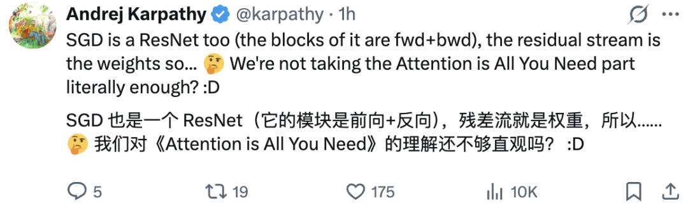

## Motivation

[Attention Residuals](https://arxiv.org/abs/2603.15031) showed that replacing fixed residual connections with attention-based ones can improve performance.

- 

Andrej Karpathy's followed up with a [thought](https://x.com/karpathy/status/2033400893346107835) whether stochastic gradient descent could also use attention in it:

- 

That made me look at Adam’s first-moment EMA differently: it compresses gradient history into a single exponentially decayed running average, much like a hidden state bottleneck in early sequential models.

So the question becomes: instead of forcing optimization history through one EMA, can an optimizer use attention to attend over recent gradients and decide what matters?

## AttnOpt: Tensorwise History Mixing

Adam's update rule uses an EMA of gradients as its first moment:

$$m_t = \beta_1 \ m_{t-1} + (1 - \beta_1) \, g_t$$

AttnOpt replaces that fixed decay with a learned, selective attention for each layer $\ell$ over a sliding window of the last $L$ gradients:

$$m_t^{(\ell)} = \beta^{(\ell)}\, g_t^{(\ell)} + \left(1-\beta^{(\ell)}\right)\sum_{i=1}^{L-1}\alpha_i^{(\ell)}\, g_{t-i}^{(\ell)}$$
$$\alpha^{(\ell)}=\text{softmax}\!\left(\left[s_1^{(\ell)},\,s_2^{(\ell)},\,\dots,\,s_{L-1}^{(\ell)}\right]\right)$$
$$s_i^{(\ell)}=\frac{q_t^{(\ell)}{k_{t-i}^{(\ell)}}^\top}{\sqrt{d_\ell}}, \qquad i\in\{1,\dots,L-1\}$$
$$q_t^{(\ell)} = g_t^{(\ell)} W_Q^{(\ell)}, \qquad k_{t-i}^{(\ell)} = g_{t-i}^{(\ell)} W_K^{(\ell)}, \qquad i \in \{1,\dots,L-1\}$$

We will also have a no parameters baseline for testing raw attention scores from cosine similarity over raw gradient history:

$$s_i^{(\ell)} = \cos\!\left(g_t^{(\ell)},\, g_{t-i}^{(\ell)}\right), \qquad i \in \{1,\dots,L-1\}$$

## Testing

The goal is to see whether AttnOpt can match or beat SGD, Adam, Muon, and a sliding-average history baseline on validation loss at a fixed token budget.

Currently we will test on LLMs, if it seems promising we might test other fields as well.

- Architecture:  Karpathy's nanoGPT architecture (with the improvements documented in [here](https://github.com/karpathy/nanochat/discussions/481))
- Pre-training dataset: HuggingFace's [FineWeb](https://huggingface.co/datasets/HuggingFaceFW/fineweb) dataset
- Training budget: ~`1.07B` tokens per run (`4,096` steps × `262,144` tokens/step).
- All history-based runs look back `8` gradients.

| ID           | First moment (m̃)                 | Second moment (v tracks EMA of…) |
| ------------ | --------------------------------- | -------------------------------- |
| `BASE-SGD`   | —                                 | —                                |
| `BASE-ADAM`  | g_t                               | g_t²                             |
| `BASE-MUON`  | —                                 | —                                |
| `AVG-8`      | 0.1·g_t + 0.9·mean(past 8)        | m̃²                              |
| `AVG-8R`     | 0.1·g_t + 0.9·mean(past 8)        | g_t²                             |
| `ATTNRAW-8`  | 0.1·g_t + 0.9·cosine-attn(past 8) | m̃²                              |
| `ATTNRAW-8R` | 0.1·g_t + 0.9·cosine-attn(past 8) | g_t²                             |
| `ATTNOPT-8`  | —                                 | —                                |

## Results

Loss curves compared in `analysis/results.ipynb`.

